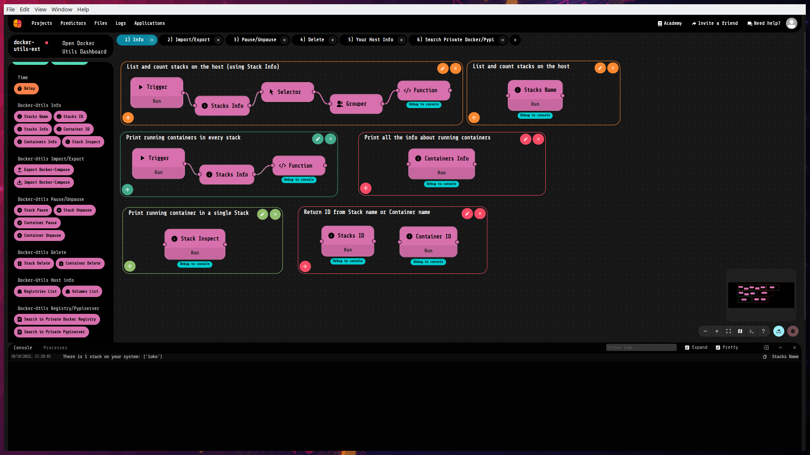

# Docker-utils-ext
### _Full control your Docker stacks with LokoAI !_ 



Docker-utils-ext is an extension for LokoAI. More info about LokoAI [Here]

With Docker-utils-ext you can manage all docker stacks on your host easily, without ever using a terminal Docker command! 🔥🔥

You can:
- View all the stacks created on your host and all their info
- View all the containers running in any stacks, with their info
- Pause/Unpause stacks and all related containers, or pause/unpause a single container
- Delete stacks and all related containers, or delete a single container
- Check all volumes created on your Docker host
- Check all Docker Registry you're logged in
- Import stacks from docker-compose.yml file
- Export stacks in a docker-compose.yml file
- Search Docker Images on Private Docker Registry
- Search Python libs on Private Pypyserver

Through LokoAI you can also open _**Docker Utils Dashboard**_, where you have a GUI that you can navigate to manually monitoring all the containers, show their logs, and much more..

# Installation
First of all, you need to copy your _~/.docker/config.json_ file inside loko folder, using this simple command as it is:

```sh
sudo mkdir -p /var/opt/loko/docker-utils-ext && sudo cp /home/$USER/.docker/config.json /var/opt/loko/docker-utils-ext/config.json
```

Than, you can import this project inside Loko and run it 😎


For more info:
- [Livetech Github]
- [fdom93 Dockerhub]

[Here]: <https://github.com/loko-ai/loko>
[Livetech Github]: <https://github.com/loko-ai>
[fdom93 Dockerhub]: <https://hub.docker.com/u/fdom93>
