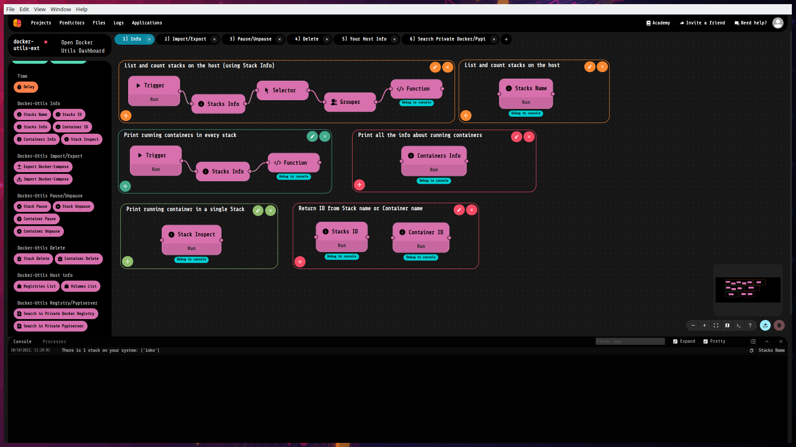

<html><p> </p> <h1>Docker-utils-ext</h1><br></html>

### _Full control your Docker stacks with LokoAI !_ 



Docker-utils-ext is an extension for LokoAI. More info about LokoAI [Here]

With Docker-utils-ext you can manage all docker stacks on your host easily, without ever using a terminal Docker command! 🔥🔥

You can:
- View all the stacks created on your host and all their info
- View all the containers running in any stacks, with their info
- Pause/Unpause stacks and all related containers, or pause/unpause a single container
- Delete stacks and all related containers, or delete a single container
- Check all volumes created on your Docker host
- Check all Docker Registry you're logged in
- Import stacks from docker-compose.yml file
- Export stacks in a docker-compose.yml file
- Search Docker Images on Private Docker Registry
- Search Python libs on Private Pypyserver

If you want pre-configured flows, you can import <a href="https://github.com/loko-ai/docker_utils_example">this project</a> 😉

Through LokoAI you can also open _**Docker Utils Dashboard**_, where you have a GUI that you can navigate to manually monitoring all the containers, show their logs, and much more..

___

# Installation
When you download this project from Loko, before start it, you need to setup your host.

### For Linux Users
You only need to copy your _~/.docker/config.json_ file inside loko folder, using this simple command as it is:

```sh
sudo mkdir -p /var/opt/loko/docker-utils-ext/volumes/templates && sudo cp $HOME/.docker/config.json /var/opt/loko/docker-utils-ext/config.json
```

Then, you can import this project inside Loko and run it 😎

___
### For Windows Users
Open Command Prompt (CMD) and run this commands:

```sh
mkdir C:\loko-volumes\docker-utils-ext\volumes\templates
```
Now you must create a docker "config.json" file with your public/private Docker Registry info (you can't use the file created by Docker Desktop because it use a "non standard" layout).

First of all, you need to create Base64 encoded "username:password" string that will be used in the next step.
So, open CMD again and run this command, replacing _**username**_ and _**password**_ with your personal Registry login info:

```sh
powershell "[convert]::ToBase64String([Text.Encoding]::UTF8.GetBytes(\"username:password\"))"
```

Now go to _**C:\loko-volumes\docker-utils-ext**_ , create a blank file called **config.json** and copy whitin it these lines:
(replace "your.private-registry.com" with your public/private registry url and "output-base64-encode" with the output of the previous command)

```sh
{
        "auths": {
                "your.private-registry.com": {
                        "auth": "output-base64-encode" 
                }
        },
        "HttpHeaders": {
                "User-Agent": "Docker-Client/19.03.5 (linux)"
        }
}
```

As a final step, open this file _**%homedrive%%homepath%\loko\shared\extensions\docker-utils-ext\config.json**_ and edit the two volumes lines with these (do NOT delete the first volume line):

```sh
C:\\loko-volumes\\docker-utils-ext\\config.json:/root/.docker/config.json
C:\\loko-volumes\\docker-utils-ext\\volumes\\templates:/templates
```

Then, you can run it in Loko 😎

___

For more info:
- [Livetech Github]
- [fdom93 Dockerhub]

[Here]: <https://github.com/loko-ai/loko>
[Livetech Github]: <https://github.com/loko-ai>
[fdom93 Dockerhub]: <https://hub.docker.com/u/fdom93>
